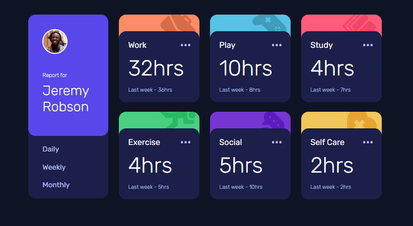

# Time Tracking Dashboard

A responsive time tracking dashboard built as part of the [Frontend Mentor challenge](https://www.frontendmentor.io/challenges/time-tracking-dashboard-UI2jvs6p6). The dashboard allows users to view time tracking data across three different time periods: Daily, Weekly, and Monthly. The design is mobile-friendly and adapts to different screen sizes.

## Features

- **User Profile**: Displays a profile card with the name of the user and an avatar.
- **Time Tracking Data**: Shows time spent on various activities such as work, play, study, exercise, socializing, and self-care.
- **Interactive View Selector**: Users can toggle between Daily, Weekly, and Monthly views to compare current and previous time tracking data.
- **Responsive Design**: The layout adjusts for desktop, tablet, and mobile screens.

## Screenshots



## Technologies Used

- **HTML**: For the structure of the dashboard.
- **SCSS**: To style the components with custom properties for colors, fonts, and layout.
- **JavaScript**: To handle data fetching and dynamic updates of the dashboard items.
- **Font**: [Rubik](https://fonts.google.com/specimen/Rubik) for clean and modern typography.

## Installation

To run this project locally:

1. Clone the repository:
   ```bash
   git clone https://github.com/yourusername/time-tracking-dashboard.git
   ```
2. Navigate into the project directory:
   ```bash
   cd time-tracking-dashboard
   ```
3. Open the `index.html` file in your browser.

## How It Works

1. **Data Fetching**: The dashboard fetches time tracking data from a JSON file (`data.json`) using JavaScript's `fetch()` API.
2. **Dynamic Content**: The time tracking data is dynamically rendered into HTML using JavaScript. Activities are added to the dashboard based on the data fetched.
3. **Responsive Views**: The dashboard displays data in a card format, with each card representing an activity. Users can switch between views (Daily, Weekly, and Monthly) to see different timeframes for each activity.

## Project Structure

- `index.html`: The main HTML file containing the layout and structure of the dashboard.
- `css/style.css`: Compiled CSS file (from SCSS) containing styles for the dashboard.
- `scss/style.scss`: SCSS file where the styles are defined.
- `script/app.js`: JavaScript file for handling data fetching and view toggling.
- `images/`: Folder containing the images (icons and user avatar).

## Running Locally

1. Download the project files to your local machine.
2. Open the `index.html` file in your browser to view the dashboard.
   
## Contributing

Feel free to fork this repository and contribute to it by submitting issues or pull requests. If you have any ideas for improvements or features, feel free to suggest them!

## License

This project is open-source and available under the [MIT License](LICENSE).

## Acknowledgements

This project was built as a challenge by [Frontend Mentor](https://www.frontendmentor.io). The design and structure were inspired by their provided mockups.

Challenge by [Frontend Mentor](https://www.frontendmentor.io)  
Coded by [Skyl1te](https://github.com/Skyl1te)